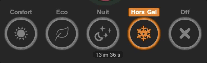

# Dynamic_Slider_Icon

Widget originel de [@theone_811](https://community.jeedom.com/u/theone_811)

Toutes les infos sur les paramètres se trouvent ici : https://community.jeedom.com/t/widget-dynamic-slider-avec-icon/45480

- Modification identation.
- Ajout de la position basse de timeCmd
- Ajout des couleurs en glissant la souris sur l'icône.
- Ajout du titre en glissant la sourcis sur la valeur selectionnée.
- Suppression valeur pour commande action/other.
- Correction valueDate non reconnue par Date().

